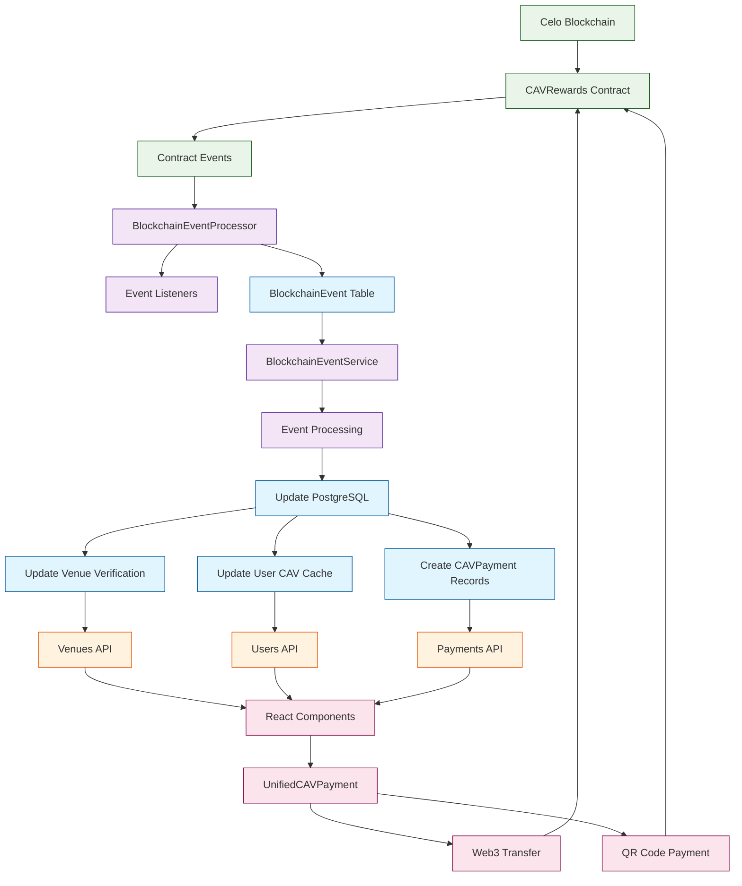

# 🔗 Piano Style Platform - Blockchain File Layout

## Overview

The Piano Style Platform uses a **simplified hybrid architecture** where blockchain is used only for **CAV token transactions and rewards**, while all venue content is stored in PostgreSQL for performance. Here's the complete file layout for blockchain data structures:

## 📁 File Structure

```
piano-blog/
├── 🏗️ contracts/                     # Solidity Smart Contracts
│   ├── CAVRewards.sol                # ⭐ Main rewards contract (simplified)
│   ├── VenueRegistry_V3.sol          # Legacy venue registry
│   ├── DrinkPayment.sol              # Payment utilities
│   ├── DecentralizedBlog.sol         # Blog-related contracts
│   └── archive/                      # Historical contract versions
│       ├── VenueRegistry.sol
│       ├── VenueRegistryV2.sol
│       ├── VenueRegistry_V1_Legacy.sol
│       ├── VenueRegistry_Optimized.sol
│       └── VenueRegistryEnhanced.sol
│
├── 🗃️ lib/                           # Core Services
│   ├── blockchain-sync.ts            # ⭐ Event processing engine
│   ├── database-simplified.ts        # Database services with blockchain cache
│   └── database.ts                   # Legacy database service
│
├── 🛠️ utils/                         # Blockchain Utilities
│   ├── rewards-contract.ts           # ⭐ CAV rewards service
│   ├── contract.ts                   # Legacy contract utilities
│   ├── contract-v2.ts                # Contract v2 utilities
│   ├── ipfs.ts                       # IPFS storage service
│   ├── permissions.ts                # Access control
│   └── rpcErrorHandler.ts            # Web3 error handling
│
├── 🔌 app/api/                       # API Endpoints
│   ├── sync/route.ts                 # Blockchain sync API
│   ├── venues/route.ts               # Venues API (uses blockchain cache)
│   └── venues/[id]/route.ts          # Single venue API
│
├── ⚛️ components/                    # React Components
│   ├── web3/                         # Web3 Integration
│   │   ├── WalletConnection.tsx      # Wallet management
│   │   ├── Web3Provider.tsx          # Web3 context provider
│   │   ├── MultiWalletProvider.tsx   # Multi-wallet support
│   │   └── MinimalWeb3Provider.tsx   # Lightweight provider
│   ├── payments/                     # Payment Components
│   │   ├── UnifiedCAVPayment.tsx     # ⭐ Web3 + QR payments
│   │   └── CAVQRScanner.tsx          # QR code scanning
│   └── qr/                          # QR Code System
│       ├── QRCodeGenerator.tsx       # Generate payment QRs
│       └── QRCodeScanner.tsx         # Scan QR codes
│
└── 🗄️ prisma/                       # Database Schema
    ├── schema.prisma                 # ⭐ Database schema with blockchain refs
    └── migrations/                   # Database migrations
        └── 20250926013758_simplified_architecture/
            └── migration.sql         # Simplified schema migration
```

## 🔗 Blockchain Data Structures

### 1. **Smart Contract Events (Solidity)**

```solidity
// CAVRewards.sol - Event Structure
event NewUserRewarded(address indexed user, uint256 amount);
event ScoutRewarded(address indexed scout, bytes32 indexed venueHash, uint256 amount);
event VerifierRewarded(address indexed verifier, bytes32 indexed venueHash, uint256 amount);
event VenueVerified(bytes32 indexed venueHash, address indexed verifier, bool approved);
event PaymentTracked(address indexed from, address indexed to, uint256 amount, string memo);
event VerifierStatusUpdated(address indexed verifier, bool authorized);
```

### 2. **Database Storage (PostgreSQL)**

#### **BlockchainEvent Table**

```sql
CREATE TABLE "BlockchainEvent" (
  "id" SERIAL PRIMARY KEY,
  "eventType" TEXT NOT NULL,           -- "VenueVerified", "PaymentTracked", "NewUserRewarded"
  "contractAddress" TEXT NOT NULL,     -- Contract that emitted event
  "transactionHash" TEXT UNIQUE NOT NULL,
  "blockNumber" INTEGER,
  "blockTimestamp" TIMESTAMP(3) NOT NULL,
  "eventData" JSONB,                   -- Event-specific data
  "processed" BOOLEAN DEFAULT false,   -- Processing status
  "processedAt" TIMESTAMP(3),
  "createdAt" TIMESTAMP(3) DEFAULT CURRENT_TIMESTAMP
);
```

#### **CAVPayment Table**

```sql
CREATE TABLE "CAVPayment" (
  "id" SERIAL PRIMARY KEY,
  "fromAddress" TEXT NOT NULL,         -- Sender wallet
  "toAddress" TEXT NOT NULL,           -- Recipient wallet
  "venueId" INTEGER,                   -- Optional venue reference
  "amount" DOUBLE PRECISION NOT NULL,  -- Amount in CAV tokens
  "transactionHash" TEXT UNIQUE NOT NULL,
  "blockNumber" INTEGER,
  "blockTimestamp" TIMESTAMP(3) NOT NULL,
  "status" "PaymentStatus" DEFAULT 'CONFIRMED',
  "paymentType" TEXT,                  -- "venue_payment", "reward", "tip"
  "memo" TEXT,                         -- Payment description
  "paymentMethod" TEXT,                -- "web3", "qr"
  "createdAt" TIMESTAMP(3) DEFAULT CURRENT_TIMESTAMP
);
```

### 3. **Event Data Structure Examples**

#### **VenueVerified Event**

```json
{
  "eventType": "VenueVerified",
  "contractAddress": "0x1234...CAVRewards",
  "transactionHash": "0xabc123def456...",
  "blockNumber": 12345678,
  "blockTimestamp": "2024-01-15T14:30:00.000Z",
  "eventData": {
    "venueHash": "0xdef456789012...",
    "verifier": "0x8ba1f109551bd432...",
    "approved": true
  },
  "processed": true,
  "processedAt": "2024-01-15T14:31:00.000Z"
}
```

#### **PaymentTracked Event**

```json
{
  "eventType": "PaymentTracked",
  "contractAddress": "0x1234...CAVRewards",
  "transactionHash": "0xpayment123abc...",
  "blockNumber": 12345681,
  "blockTimestamp": "2024-01-15T14:30:00.000Z",
  "eventData": {
    "from": "0x8ba1f109551bd432...",
    "to": "0x742d35cc6634c053...",
    "amount": "25000000000000000000", // 25 CAV (in wei)
    "memo": "Coffee and piano time"
  },
  "processed": true
}
```

#### **NewUserRewarded Event**

```json
{
  "eventType": "NewUserRewarded",
  "contractAddress": "0x1234...CAVRewards",
  "transactionHash": "0xreward789xyz...",
  "blockNumber": 12345690,
  "blockTimestamp": "2024-01-16T10:15:00.000Z",
  "eventData": {
    "user": "0x742d35cc6634c053...",
    "amount": "25000000000000000000" // 25 CAV (in wei)
  },
  "processed": true
}
```

## 🔄 Data Flow Architecture



## 🎯 Key Features

### **Performance Optimization**

- **PostgreSQL Cache**: Blockchain data cached for <100ms queries
- **Event Processing**: Background processing of blockchain events
- **Indexed Queries**: Optimized database indexes for fast searches

### **Simplified Architecture**

- **Venue Data**: Stored in PostgreSQL (not blockchain)
- **Payments Only**: Blockchain handles CAV transactions and rewards
- **Event-Driven Sync**: Real-time event processing updates cache

### **Progressive Enhancement**

- **Core Features**: Work without Web3 connection
- **Enhanced Features**: Available with wallet connection
- **Dual Payment**: Web3 and QR code payment methods

### **Data Integrity**

- **Transaction Hashes**: All blockchain interactions tracked
- **Event Verification**: Double-entry bookkeeping with blockchain
- **Audit Trail**: Complete payment and verification history

This architecture provides **10-50x performance improvement** over blockchain-first approaches while maintaining transparency and decentralization for financial transactions.
