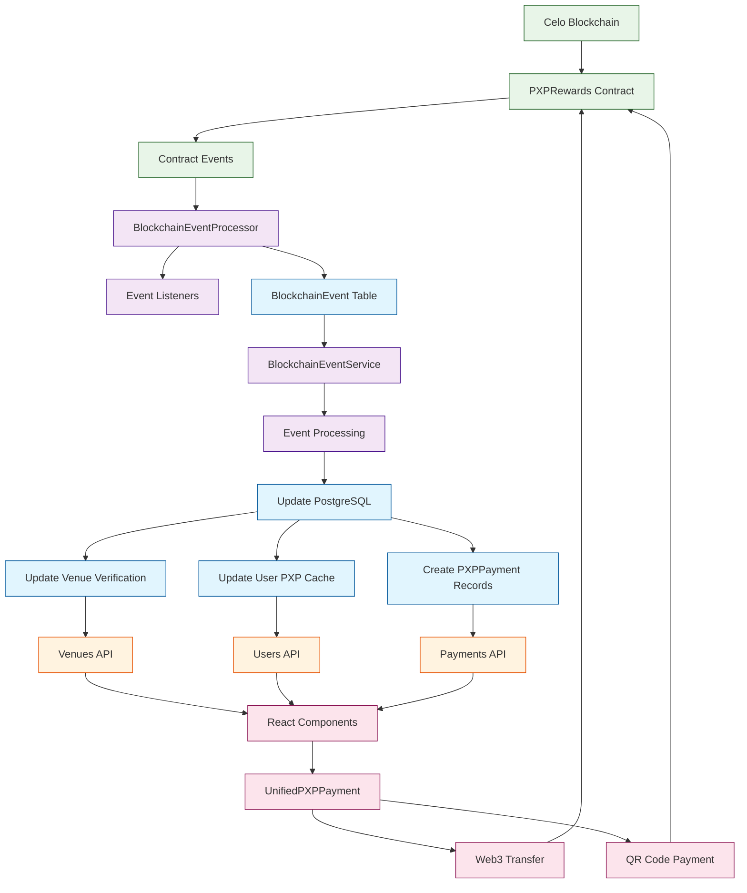

# 🔗 Piano Style Platform - Blockchain File Layout

## Overview

The Piano Style Platform uses a **simplified hybrid architecture** where blockchain is used only for **PXP token transactions and rewards**, while all venue content is stored in PostgreSQL for performance. Here's the complete file layout for blockchain data structures:

### Contract Organization

**Active Contracts (Deployed on Celo Sepolia):**

- All production contracts are in `foundry-contracts/src/`
- See [DEPLOYED_CONTRACTS.md](./DEPLOYED_CONTRACTS.md) for deployment details and addresses

**Legacy Contracts:**

- `contracts/` contains old pre-foundry development code (not deployed)
- `contracts/archive/` contains archived iterations from development phase
- These are kept for reference but are not actively used

## 📁 File Structure

```
piano-blog/
├── 🏗️ foundry-contracts/             # ⭐ Active Smart Contracts (Deployed)
│   └── src/
│       ├── PXPToken.sol              # ⭐ PXP ERC20 token (0x04eA...1c75)
│       ├── PXPRewards.sol            # ⭐ PXP rewards V1 (0x28aC...6128)
│       └── VenueRegistry.sol         # ⭐ Venue registry V1 (0x325F...645E)
│
├── 🏗️ contracts/                     # Legacy/Development Contracts
│   ├── PXPRewards.sol                # Old PXP rewards (pre-foundry)
│   ├── DrinkPayment.sol              # Payment utilities (not deployed)
│   ├── DecentralizedBlog.sol         # Blog contracts (not deployed)
│   └── archive/                      # Archived development iterations
│       ├── VenueRegistry_V3.sol      # Old venue registry v3
│       ├── VenueRegistry_Fixed.sol   # Old venue registry iteration
│       ├── VenueRegistry_Simple.sol  # Old venue registry iteration
│       ├── VenueRegistry.sol         # Original venue registry
│       ├── VenueRegistry_V1_Legacy.sol
│       ├── VenueRegistry_Optimized.sol
│       └── VenueRegistryEnhanced.sol
│
├── 🗃️ lib/                           # Core Services
│   ├── blockchain-sync.ts            # ⭐ Event processing engine
│   ├── database-simplified.ts        # Database services with blockchain cache
│   ├── database.ts                   # Legacy database service
│   ├── auth.ts                       # Authentication service
│   ├── auth-middleware.ts            # Auth middleware
│   └── email.ts                      # Email service
│
├── 🛠️ utils/                         # Blockchain Utilities
│   ├── rewards-contract.ts           # ⭐ PXP rewards service
│   ├── contract.ts                   # Legacy contract utilities
│   ├── ipfs.ts                       # IPFS storage service
│   ├── permissions.ts                # Access control
│   └── rpcErrorHandler.ts            # Web3 error handling
│
├── 🔌 app/api/                       # API Endpoints
│   ├── sync/route.ts                 # Blockchain sync API
│   ├── venues/route.ts               # Venues API (uses blockchain cache)
│   ├── venues/[id]/route.ts          # Single venue API
│   ├── events/                       # Events API
│   ├── auth/                         # Authentication API
│   ├── account/                      # User account API
│   ├── profile/                      # User profile API
│   ├── admin/                        # Admin API
│   ├── musicians/                    # Musicians API
│   └── newsletter/                   # Newsletter API
│
├── ⚛️ components/                    # React Components
│   ├── web3/                         # Web3 Integration
│   │   ├── WalletConnection.tsx      # Wallet management UI
│   │   ├── WorkingWeb3Provider.tsx   # ⭐ Web3 context provider
│   │   └── DebugInfo.tsx             # Web3 debugging utilities
│   ├── payments/                     # Payment Components
│   │   ├── UnifiedPXPPayment.tsx     # ⭐ Web3 + QR payments
│   │   └── PXPQRScanner.tsx          # QR code scanning
│   └── qr/                          # QR Code System
│       ├── QRCodeGenerator.tsx       # Generate payment QRs
│       ├── QRCodeScanner.tsx         # Scan QR codes
│       ├── VenueQRCard.tsx           # Venue QR display
│       └── UserProfileQRCard.tsx     # User profile QR display
│
└── 🗄️ prisma/                       # Database Schema
    ├── schema.prisma                 # ⭐ Database schema with blockchain refs
    └── migrations/                   # Database migrations
        └── 20250926013758_simplified_architecture/
            └── migration.sql         # Simplified schema migration
```

## 🔗 Blockchain Data Structures

### 1. **Smart Contract Events (Solidity)**

```solidity
// PXPRewards.sol - Event Structure
event NewUserRewarded(address indexed user, uint256 amount);
event ScoutRewarded(address indexed scout, bytes32 indexed venueHash, uint256 amount);
event VerifierRewarded(address indexed verifier, bytes32 indexed venueHash, uint256 amount);
event VenueVerified(bytes32 indexed venueHash, address indexed verifier, bool approved);
event PaymentTracked(address indexed from, address indexed to, uint256 amount, string memo);
event VerifierStatusUpdated(address indexed verifier, bool authorized);
```

**Note**: TCoin is under consideration for future implementation but is not part of Sprint 2.

### 2. **Database Storage (PostgreSQL)**

#### **BlockchainEvent Table**

```sql
CREATE TABLE "BlockchainEvent" (
  "id" SERIAL PRIMARY KEY,
  "eventType" TEXT NOT NULL,           -- "VenueVerified", "PaymentTracked", "NewUserRewarded"
  "contractAddress" TEXT NOT NULL,     -- Contract that emitted event
  "transactionHash" TEXT UNIQUE NOT NULL,
  "blockNumber" INTEGER,
  "blockTimestamp" TIMESTAMP(3) NOT NULL,
  "eventData" JSONB,                   -- Event-specific data
  "processed" BOOLEAN DEFAULT false,   -- Processing status
  "processedAt" TIMESTAMP(3),
  "createdAt" TIMESTAMP(3) DEFAULT CURRENT_TIMESTAMP
);
```

#### **PXPPayment Table**

```sql
CREATE TABLE "PXPPayment" (
  "id" SERIAL PRIMARY KEY,
  "fromAddress" TEXT NOT NULL,         -- Sender wallet
  "toAddress" TEXT NOT NULL,           -- Recipient wallet
  "venueId" INTEGER,                   -- Optional venue reference
  "amount" DOUBLE PRECISION NOT NULL,  -- Amount in PXP tokens
  "transactionHash" TEXT UNIQUE NOT NULL,
  "blockNumber" INTEGER,
  "blockTimestamp" TIMESTAMP(3) NOT NULL,
  "status" "PaymentStatus" DEFAULT 'CONFIRMED',
  "paymentType" TEXT,                  -- "venue_payment", "reward", "tip"
  "memo" TEXT,                         -- Payment description
  "paymentMethod" TEXT,                -- "web3", "qr"
  "createdAt" TIMESTAMP(3) DEFAULT CURRENT_TIMESTAMP
);
```

**Migration Note**: Run `npx prisma migrate deploy` to rename the existing `CAVPayment` table to `PXPPayment` (migration: `20251209150752_rename_cavpayment_to_pxppayment`).

### 3. **Event Data Structure Examples**

#### **VenueVerified Event**

```json
{
  "eventType": "VenueVerified",
  "contractAddress": "0x1234...PXPRewards",
  "transactionHash": "0xabc123def456...",
  "blockNumber": 12345678,
  "blockTimestamp": "2024-01-15T14:30:00.000Z",
  "eventData": {
    "venueHash": "0xdef456789012...",
    "verifier": "0x8ba1f109551bd432...",
    "approved": true
  },
  "processed": true,
  "processedAt": "2024-01-15T14:31:00.000Z"
}
```

#### **PaymentTracked Event**

```json
{
  "eventType": "PaymentTracked",
  "contractAddress": "0x1234...PXPRewards",
  "transactionHash": "0xpayment123abc...",
  "blockNumber": 12345681,
  "blockTimestamp": "2024-01-15T14:30:00.000Z",
  "eventData": {
    "from": "0x8ba1f109551bd432...",
    "to": "0x742d35cc6634c053...",
    "amount": "25000000000000000000", // 25 PXP (in wei)
    "memo": "Coffee and piano time"
  },
  "processed": true
}
```

#### **NewUserRewarded Event**

```json
{
  "eventType": "NewUserRewarded",
  "contractAddress": "0x1234...PXPRewards",
  "transactionHash": "0xreward789xyz...",
  "blockNumber": 12345690,
  "blockTimestamp": "2024-01-16T10:15:00.000Z",
  "eventData": {
    "user": "0x742d35cc6634c053...",
    "amount": "25000000000000000000" // 25 PXP (in wei)
  },
  "processed": true
}
```

## 🔄 Data Flow Architecture


```mermaid
graph TD
    %% Blockchain Layer
    A[Celo Blockchain] --> B[PXPRewards Contract]
    B --> C[Contract Events]

    %% Event Processing
    C --> D[BlockchainEventProcessor]
    D --> E[Event Listeners]
    D --> F[BlockchainEvent Table]

    %% Database Processing
    F --> G[BlockchainEventService]
    G --> H[Event Processing]
    H --> I[Update PostgreSQL]

    %% Database Updates
    I --> J[Update Venue Verification]
    I --> K[Update User PXP Cache]
    I --> L[Create PXPPayment Records]

    %% API Layer
    J --> M[Venues API]
    K --> N[Users API]
    L --> O[Payments API]

    %% Frontend
    M --> P[React Components]
    N --> P
    O --> P

    %% Payment Flow
    P --> Q[UnifiedPXPPayment]
    Q --> R[Web3 Transfer]
    Q --> S[QR Code Payment]
    R --> B
    S --> B

    %% Styling
    classDef blockchain fill:#e8f5e8,stroke:#1b5e20
    classDef processing fill:#f3e5f5,stroke:#4a148c
    classDef database fill:#e1f5fe,stroke:#01579b
    classDef api fill:#fff3e0,stroke:#e65100
    classDef frontend fill:#fce4ec,stroke:#880e4f

    class A,B,C blockchain
    class D,E,G,H processing
    class F,I,J,K,L database
    class M,N,O api
    class P,Q,R,S frontend
```

## 🎯 Key Features

### **Performance Optimization**

- **PostgreSQL Cache**: Blockchain data cached for <100ms queries
- **Event Processing**: Background processing of blockchain events
- **Indexed Queries**: Optimized database indexes for fast searches

### **Simplified Architecture**

- **Venue Data**: Stored in PostgreSQL (not blockchain)
- **Payments Only**: Blockchain handles PXP transactions and rewards
- **Event-Driven Sync**: Real-time event processing updates cache

### **Progressive Enhancement**

- **Core Features**: Work without Web3 connection
- **Enhanced Features**: Available with wallet connection
- **Dual Payment**: Web3 and QR code payment methods

### **Data Integrity**

- **Transaction Hashes**: All blockchain interactions tracked
- **Event Verification**: Double-entry bookkeeping with blockchain
- **Audit Trail**: Complete payment and verification history

This architecture provides **10-50x performance improvement** over blockchain-first approaches while maintaining transparency and decentralization for financial transactions.
