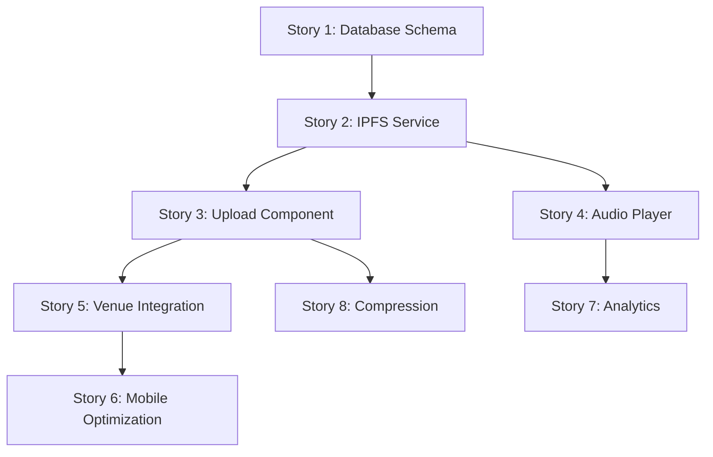

# 🎵 Audio Integration - Jira Stories

## Epic: Audio File Storage Integration

**Epic Summary**: Enable audio file uploads and storage on IPFS to document venue acoustics and performances

**Epic Description**:
Implement audio file storage capability allowing users to upload audio recordings (exported from Dolby On or other audio apps) to document venue acoustics, piano quality, and performances. Files stored on IPFS with metadata in PostgreSQL for fast queries.

**Epic Value**: Unique differentiator - first venue platform with comprehensive audio documentation

---

## 🏗️ Phase 1 Stories (Sprint 1)

### Story 1: Database Schema for Audio Storage

**Story Points**: 3
**Labels**: Backend, Database
**Priority**: High

**Summary**: Create database schema for storing audio file metadata

**Description**:
As a developer, I need to create database tables to store audio file metadata so that audio files can be properly catalogued and linked to venues.

**Acceptance Criteria**:

- [ ] Create `VenueAudio` table with all required fields
- [ ] Add proper indexes for performance (venueId, audioType)
- [ ] Create database migration script
- [ ] Update Prisma schema and regenerate client
- [ ] Verify foreign key relationships work correctly

**Technical Notes**:

```sql
CREATE TABLE VenueAudio (
  id SERIAL PRIMARY KEY,
  venueId INTEGER REFERENCES Venue(id),
  title TEXT NOT NULL,
  description TEXT,
  ipfsHash TEXT UNIQUE NOT NULL,
  duration INTEGER, -- seconds
  recordedAt TIMESTAMP,
  recordedBy TEXT, -- wallet address
  audioType TEXT, -- "piano_solo", "ambient", "performance"
  equipment TEXT, -- "Dolby On", "iPhone", "professional"
  fileSize INTEGER,
  mimeType TEXT,
  processed BOOLEAN DEFAULT false,
  createdAt TIMESTAMP DEFAULT CURRENT_TIMESTAMP
);
```

**Definition of Done**:

- Database migration runs successfully
- Prisma client generates without errors
- Can create, read, update, delete audio records
- Performance indexes are in place

---

### Story 2: Extend IPFS Service for Audio Files

**Story Points**: 5
**Labels**: Backend, IPFS
**Priority**: High

**Summary**: Extend existing IPFS service to handle audio file uploads

**Description**:
As a developer, I need to extend the existing IPFSService to handle audio file uploads so that audio files can be stored permanently on IPFS.

**Acceptance Criteria**:

- [ ] Add audio file validation (format, size, duration)
- [ ] Implement audio file compression (optional)
- [ ] Add audio-specific metadata handling
- [ ] Create audio upload method with progress tracking
- [ ] Handle audio file retrieval from IPFS
- [ ] Add error handling for audio-specific issues

**Technical Notes**:

- Extend existing `utils/ipfs.ts`
- Support MP3, AAC, WAV formats
- Maximum file size: 50MB
- Add audio duration extraction
- Implement upload progress callbacks

**Definition of Done**:

- Can upload audio files to IPFS successfully
- File validation works for supported formats
- Progress tracking works during upload
- Error handling covers common failure cases
- Audio metadata is properly extracted and stored

---

### Story 3: Audio Upload Component

**Story Points**: 8
**Labels**: Frontend, React
**Priority**: High

**Summary**: Create React component for audio file uploads

**Description**:
As a blog owner, I want to upload audio files through a web interface so that I can add audio documentation to venues.

**Acceptance Criteria**:

- [ ] File input accepts audio formats (MP3, AAC, WAV)
- [ ] Form includes title, description, audio type fields
- [ ] Upload progress indicator shows during IPFS upload
- [ ] File validation with user-friendly error messages
- [ ] Mobile-responsive design for phone uploads
- [ ] Preview audio before upload (optional)

**Technical Notes**:

- Use HTML5 file input with accept="audio/\*"
- Integrate with existing form patterns
- Show file size and duration
- Mobile-optimized for Termux workflow
- Follow existing component styling

**Definition of Done**:

- Component renders correctly on desktop and mobile
- File upload works end-to-end to IPFS
- Form validation prevents invalid uploads
- Progress indicator shows during upload
- Success/error states handled properly
- Integrates with venue pages

---

### Story 4: Audio Player Component

**Story Points**: 5
**Labels**: Frontend, React
**Priority**: Medium

**Summary**: Create audio player component for venue pages

**Description**:
As a venue visitor, I want to listen to audio recordings of venues so that I can understand the acoustic qualities before visiting.

**Acceptance Criteria**:

- [ ] HTML5 audio player with custom controls
- [ ] Play/pause, seek, volume controls
- [ ] Shows audio title, duration, recording info
- [ ] Mobile-friendly controls and layout
- [ ] Loading state while fetching from IPFS
- [ ] Error handling for failed audio loads

**Technical Notes**:

- Use HTML5 `<audio>` element
- Custom controls following design system
- IPFS gateway URLs for audio sources
- Responsive design for mobile
- Loading states and error boundaries

**Definition of Done**:

- Audio plays correctly from IPFS URLs
- Controls work on desktop and mobile
- Loading and error states function properly
- Follows existing design patterns
- Accessible audio controls

---

### Story 5: Integrate Audio Upload with Venue Pages

**Story Points**: 3
**Labels**: Frontend, Integration
**Priority**: Medium

**Summary**: Add audio upload functionality to venue detail pages

**Description**:
As a blog owner, I want to upload audio files directly from venue pages so that audio is properly associated with specific venues.

**Acceptance Criteria**:

- [ ] Add "Upload Audio" button to venue detail pages
- [ ] Audio upload form opens in modal or separate section
- [ ] Uploaded audio automatically links to current venue
- [ ] Audio list shows on venue page after upload
- [ ] Only authorized users can upload audio

**Technical Notes**:

- Integrate with existing `VenueDetailsView` component
- Use existing modal patterns
- Pass venueId to upload component
- Update venue page after successful upload

**Definition of Done**:

- Upload button appears on venue pages
- Audio upload links correctly to venue
- Venue page shows audio list after upload
- Only authorized users see upload option
- UI follows existing patterns

---

## 🚀 Phase 2 Stories (Sprint 2)

### Story 6: Mobile-Optimized Upload Interface

**Story Points**: 5
**Labels**: Frontend, Mobile, PWA
**Priority**: Medium

**Summary**: Optimize audio upload for mobile browsers and Termux workflow

**Description**:
As a mobile user using Termux, I want an optimized upload interface so that I can easily upload Dolby On exported files from my phone.

**Acceptance Criteria**:

- [ ] Mobile-first responsive design
- [ ] Touch-friendly file selection
- [ ] Works well in mobile browsers
- [ ] Progress indicators optimized for mobile
- [ ] Handles mobile network interruptions gracefully

**Definition of Done**:

- Works smoothly on mobile browsers
- File upload from Termux filesystem works
- Mobile UI is intuitive and fast
- Network issues handled gracefully

---

### Story 7: Audio Analytics and Tracking

**Story Points**: 3
**Labels**: Backend, Analytics
**Priority**: Low

**Summary**: Track audio upload and playback analytics

**Description**:
As a platform owner, I want to track audio engagement so that I can understand which audio content is most valuable.

**Acceptance Criteria**:

- [ ] Track audio uploads per venue
- [ ] Track audio plays and duration listened
- [ ] Store analytics in existing analytics system
- [ ] Dashboard views for audio metrics

**Definition of Done**:

- Audio upload events tracked
- Audio playback events tracked
- Analytics data stored correctly
- Basic metrics available in admin view

---

### Story 8: Audio Quality and Compression

**Story Points**: 5
**Labels**: Backend, Performance
**Priority**: Low

**Summary**: Implement audio compression and quality optimization

**Description**:
As a platform owner, I want to optimize audio file sizes so that IPFS storage costs are minimized and loading is faster.

**Acceptance Criteria**:

- [ ] Client-side audio compression before upload
- [ ] Multiple quality levels (high, medium, low)
- [ ] Automatic compression based on file size
- [ ] Quality selection option for users

**Definition of Done**:

- Audio files are compressed appropriately
- Multiple quality options available
- Compression reduces file sizes significantly
- Quality remains acceptable after compression

---

## 🎯 Phase 3 Stories (Future Sprints)

### Story 9: CAV Token Audio Payments

**Story Points**: 8
**Labels**: Blockchain, Payments
**Priority**: Low

**Summary**: Enable CAV token payments for premium audio content

**Description**:
As a platform user, I want to pay CAV tokens for premium audio content so that I can access exclusive venue recordings.

---

### Story 10: Audio NFT Integration

**Story Points**: 13
**Labels**: Blockchain, NFT
**Priority**: Low

**Summary**: Create NFT tokens for unique venue audio recordings

**Description**:
As a venue recorder, I want to mint NFTs of unique venue recordings so that I can monetize high-quality audio documentation.

---

## 📋 Story Dependencies



## 🏷️ Label Definitions

- **Backend**: Server-side development (database, APIs, services)
- **Frontend**: Client-side development (React components, UI)
- **Database**: Schema changes, migrations, queries
- **IPFS**: Distributed storage implementation
- **Mobile**: Mobile-specific optimizations
- **PWA**: Progressive Web App features
- **Blockchain**: Web3 and smart contract integration
- **Analytics**: Tracking and metrics
- **Performance**: Optimization and speed improvements

## 📊 Story Points Guide

- **1-2 points**: Simple changes, configuration updates
- **3-5 points**: Standard features, single components
- **8 points**: Complex features, multiple components
- **13+ points**: Large features, multiple sprints

## 🎯 Sprint Planning Notes

**Sprint 1 (Minimum Viable Audio)**:

- Stories 1, 2, 3, 4, 5
- **Total**: ~24 story points
- **Goal**: Basic audio upload and playback working

**Sprint 2 (Enhancement)**:

- Stories 6, 7, 8
- **Total**: ~13 story points
- **Goal**: Mobile optimization and quality features

**Future Sprints**:

- Stories 9, 10 (when blockchain features are prioritized)

## ✅ Ready for Jira Import

Each story above is formatted for easy copy-paste into Jira with:

- Clear title and summary
- Detailed description with user story format
- Specific acceptance criteria
- Technical implementation notes
- Definition of Done criteria
- Story point estimates
- Priority and label assignments
