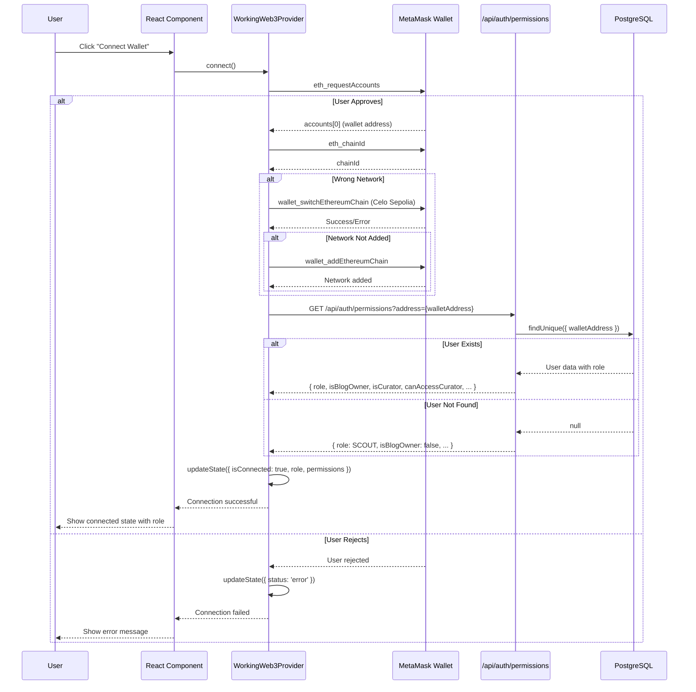
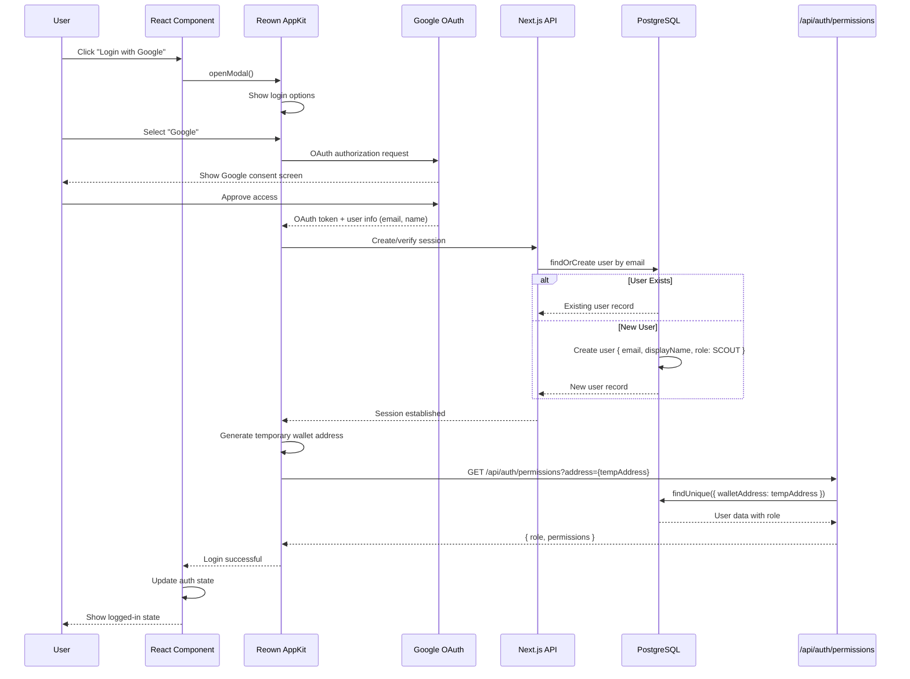
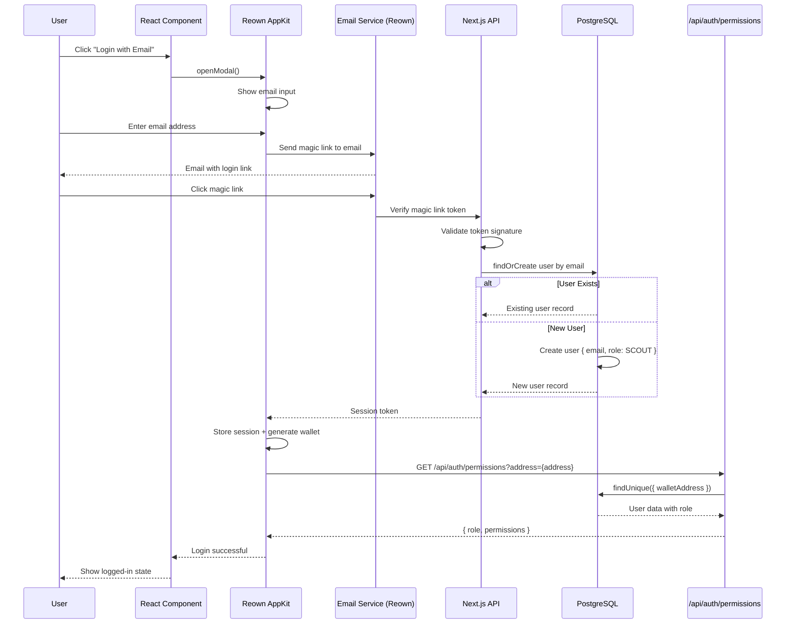
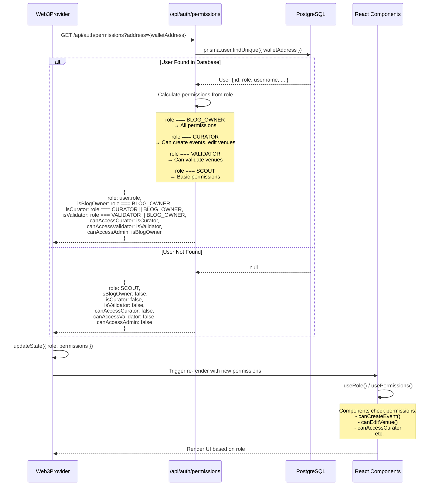
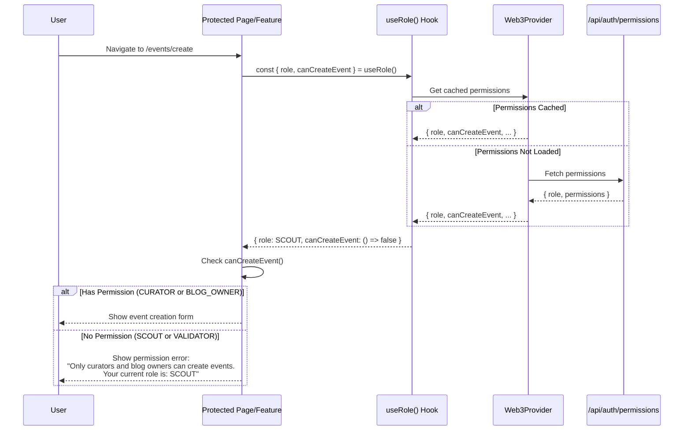
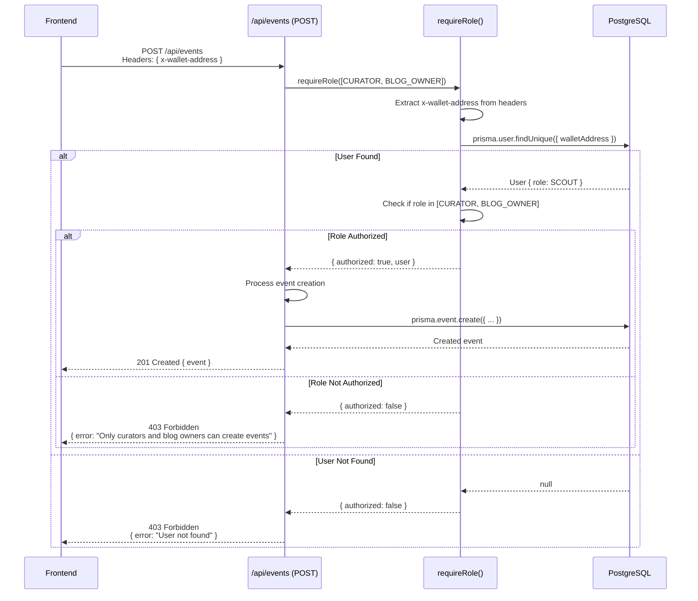
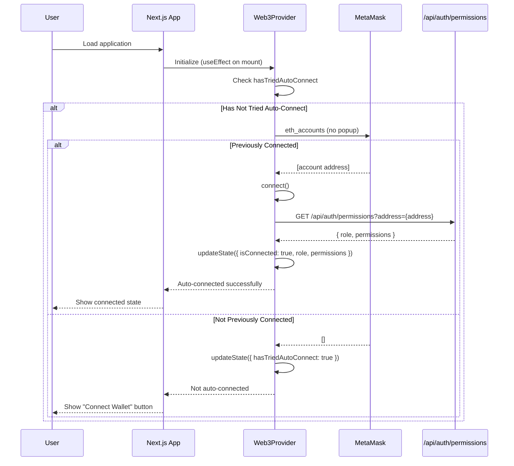

# Login Process - Sequence Diagrams

This document provides sequence diagrams for the various authentication flows in the Piano Blog application.

## Overview

The Piano Blog supports three primary authentication methods:

1. **Web3 Wallet** (MetaMask) - Blockchain wallet connection
2. **Google OAuth** - Social login via Reown AppKit
3. **Email Login** - Email-based authentication via Reown AppKit

All methods integrate with the role-based permission system (RBAC) to determine user capabilities.

---

## 1. MetaMask Wallet Connection Flow



---

## 2. Google OAuth Login Flow



---

## 3. Email Login Flow



---

## 4. Permission Resolution Flow

This flow occurs after any successful authentication method.



---

## 5. Role-Based Access Control (RBAC) Check Flow

This flow shows how protected pages/features check user permissions.



---

## 6. API Authorization Flow (Protected Endpoints)

Example: Creating an event (requires CURATOR or BLOG_OWNER role)



---

## 7. Auto-Connect Flow (Returning Users)



---

## Key Components

### Frontend

- **`WorkingWeb3Provider.tsx`**: Main Web3 context provider, manages wallet connection state
- **`ReownProvider.tsx`**: Reown AppKit configuration for multi-auth support
- **`hooks/useRole.ts`**: Permission helper hook with `canCreateEvent()`, `canEditVenue()`, etc.
- **`hooks/useHybridWallet.ts`**: Unified wallet interface for Web3 + OAuth

### Backend

- **`/api/auth/permissions/route.ts`**: Returns role-based permissions for a wallet address
- **`lib/auth-middleware.ts`**: `requireRole()` middleware for protecting API endpoints
- **Database**: PostgreSQL with Prisma ORM, stores user roles (BLOG_OWNER, CURATOR, VALIDATOR, SCOUT)

### Authentication Methods

1. **MetaMask/Web3**: Direct blockchain wallet connection
2. **Google OAuth**: Social login via Reown AppKit
3. **Email**: Magic link authentication via Reown AppKit

---

## Role Hierarchy

```
BLOG_OWNER (highest privileges)
├── Can manage curators (add/remove)
├── Can create events
├── Can edit venues
├── Can validate venues
└── All admin functions

CURATOR
├── Can create events
├── Can edit venues
└── Can access curator dashboard

VALIDATOR
├── Can validate venues
└── Can access validator dashboard

SCOUT (default role)
├── Can submit venues
├── Can RSVP to events
├── Can refer other users
└── Basic read access
```

---

## Security Notes

1. **No Private Keys on Server**: Wallet-based auth uses signature verification, never stores private keys
2. **Role-Based Authorization**: All protected endpoints check user role via `requireRole()` middleware
3. **Database-Driven Permissions**: Roles stored in PostgreSQL, cached in frontend for UX
4. **Network Validation**: MetaMask connections enforce Celo Sepolia network
5. **Session Management**: OAuth logins maintain server-side sessions with token validation

---

## Error Handling

### Connection Errors

- **MetaMask not installed**: Show "Install MetaMask" message
- **Wrong network**: Auto-prompt to switch to Celo Sepolia
- **User rejection**: Show friendly error, allow retry

### Permission Errors

- **Insufficient permissions**: Show role-specific error message with contact info
- **Session expired**: Auto-redirect to login
- **Invalid token**: Clear session, require re-authentication

---

## Future Enhancements

1. **Referral System** (Task 2.6): Track user referrals and award PXP rewards
2. **Multi-Wallet Support**: Allow users to link multiple wallets to one account
3. **Role Upgrade Requests**: UI for scouts to request curator permissions
4. **Session Persistence**: Remember user preferences across sessions
