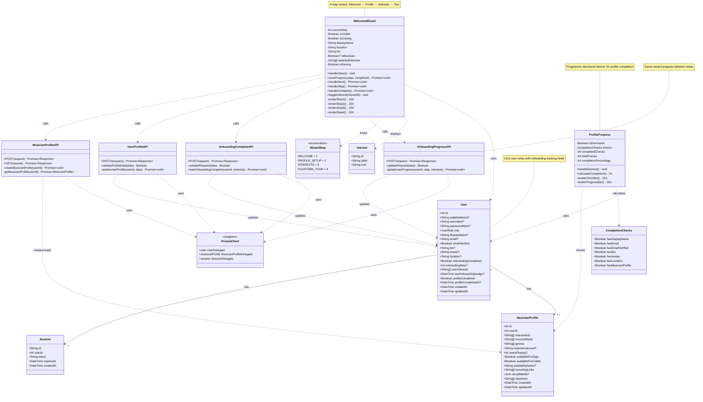
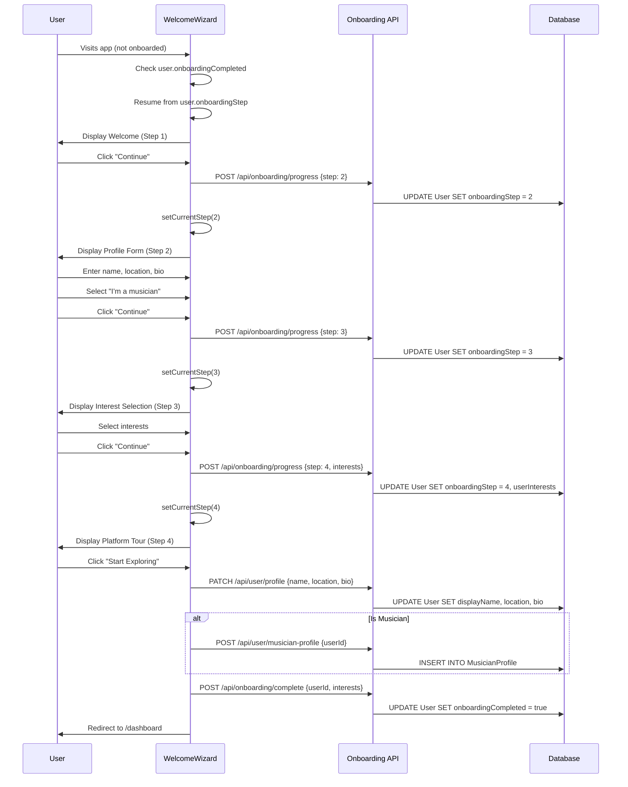
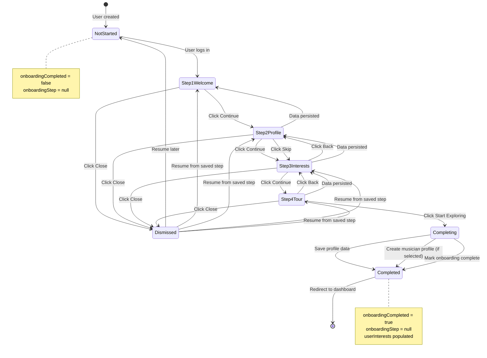

# Onboarding System - Class Diagram



## Onboarding Flow Sequence



## State Machine Diagram



## Key Design Patterns

### 1. **Wizard Pattern**

- Multi-step form with progress tracking
- State persistence between steps
- Resume capability from last saved step

### 2. **Progressive Disclosure**

- `ProfileProgress` component shows completion percentage
- Only displays missing profile items
- Dismissible banner for non-intrusive nudging

### 3. **Repository Pattern**

- All database access through Prisma ORM
- API routes act as service layer
- Clear separation between UI and data access

### 4. **State Management**

- Local state in React components (useState)
- Server state synchronized via API calls
- Optimistic UI updates with error handling

## Database Schema (Onboarding Fields)

```sql
-- User table (onboarding-related fields)
CREATE TABLE "User" (
  "id" SERIAL PRIMARY KEY,

  -- Onboarding tracking
  "onboardingCompleted" BOOLEAN DEFAULT false,
  "onboardingStep" INTEGER,
  "userInterests" TEXT[] DEFAULT '{}',
  "lastOnboardingNudge" TIMESTAMP,

  -- Profile completion
  "profileCompleted" BOOLEAN DEFAULT false,
  "profileCompletedAt" TIMESTAMP,

  -- Profile fields
  "displayName" TEXT,
  "email" TEXT,
  "emailVerified" BOOLEAN DEFAULT false,
  "bio" TEXT,
  "avatar" TEXT,
  "location" TEXT,

  "createdAt" TIMESTAMP DEFAULT CURRENT_TIMESTAMP,
  "updatedAt" TIMESTAMP DEFAULT CURRENT_TIMESTAMP
);

-- MusicianProfile table
CREATE TABLE "MusicianProfile" (
  "id" SERIAL PRIMARY KEY,
  "userId" INTEGER UNIQUE REFERENCES "User"("id") ON DELETE CASCADE,

  "instruments" TEXT[],
  "musicalStyles" TEXT[],
  "genres" TEXT[],
  "experienceLevel" TEXT,
  "yearsPlaying" INTEGER,
  "availableForGigs" BOOLEAN DEFAULT false,
  "availableForCollab" BOOLEAN DEFAULT false,

  "createdAt" TIMESTAMP DEFAULT CURRENT_TIMESTAMP,
  "updatedAt" TIMESTAMP DEFAULT CURRENT_TIMESTAMP
);
```

## API Endpoints

### POST /api/onboarding/progress

Save wizard progress between steps.

**Request:**

```json
{
  "userId": 123,
  "step": 2,
  "completed": false,
  "interests": ["discover-venues", "attend-events"]
}
```

**Response:**

```json
{
  "success": true
}
```

### POST /api/onboarding/complete

Mark onboarding as complete.

**Request:**

```json
{
  "userId": 123,
  "interests": ["discover-venues", "attend-events", "connect-musicians"]
}
```

**Response:**

```json
{
  "success": true
}
```

### PATCH /api/user/profile

Update user profile information.

**Request:**

```json
{
  "displayName": "John Doe",
  "location": "Toronto, Canada",
  "bio": "Piano enthusiast exploring jazz..."
}
```

### POST /api/user/musician-profile

Create musician profile.

**Request:**

```json
{
  "userId": 123
}
```

**Response:**

```json
{
  "success": true,
  "profile": {
    "id": 456,
    "userId": 123,
    "instruments": [],
    "musicalStyles": []
  }
}
```

## Component Props

### WelcomeWizard

```typescript
interface WelcomeWizardProps {
  user: {
    id: number
    displayName?: string | null
    username?: string | null
    avatar?: string | null
    onboardingCompleted: boolean
    onboardingStep?: number | null
  }
}
```

### ProfileProgress

```typescript
interface ProfileProgressProps {
  user: {
    id: number
    displayName?: string | null
    email?: string | null
    emailVerified: boolean
    bio?: string | null
    avatar?: string | null
    location?: string | null
    walletAddress?: string | null
    username?: string | null
  }
  hasMusicianProfile: boolean
  onDismiss?: () => void
}
```

## Onboarding Steps Detail

### Step 1: Welcome

- **Purpose:** Greet user and set expectations
- **UI:** Welcome message with piano emoji 🎹
- **CTA:** "Continue" button
- **Skip:** Not allowed

### Step 2: Profile Setup

- **Purpose:** Collect basic profile information
- **Fields:**
  - Display Name (text input)
  - Location (text input, optional)
  - Bio (textarea, optional)
  - Are you a musician? (Yes/No buttons)
- **CTA:** "Continue" or "Skip"
- **Skip:** Allowed, proceeds to Step 3

### Step 3: Interests Selection

- **Purpose:** Understand user goals and personalize experience
- **Options:**
  - 🗺️ Discover piano venues in my area
  - 📝 Submit venues I know about
  - 🎵 Attend jam sessions and events
  - 🤝 Connect with other musicians
  - 🎹 Share my music and performances
- **Selection:** Multi-select (0 or more)
- **CTA:** "Continue"
- **Navigation:** Can go back to Step 2

### Step 4: Platform Tour

- **Purpose:** Educate user about platform features
- **Content:**
  - 🗺️ Venues - Browse and submit
  - 🎵 Events - Find and RSVP
  - 👤 Profile - Build musician profile
  - 🎁 Rewards - Earn PXP tokens
- **CTA:** "Start Exploring!"
- **Navigation:** Can go back to Step 3
- **Action:** Saves all data and redirects to dashboard

## Profile Completion Criteria

ProfileProgress component calculates completion based on:

1. ✅ Has Display Name
2. ✅ Has Email Address
3. ✅ Email Verified
4. ✅ Has Bio
5. ✅ Has Avatar/Photo
6. ✅ Has Location
7. ✅ Has Musician Profile (for musicians)

**Completion Percentage:** `(completed / total) * 100`

**Display:**

- Shows progress bar
- Lists missing items
- Provides direct links to edit profile
- Can be dismissed (stored in user preferences)
